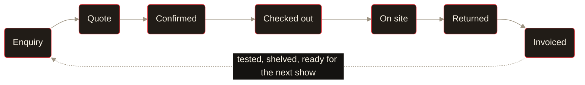

<!-- Owner: Jayden Nawotka · Last reviewed: 2026-08-01 (review quarterly — POLICY.md R-5.5) -->

 

<picture>
  <source media="(prefers-color-scheme: dark)" srcset="docs/brand/rvlt-flow-wordmark-dark.svg">
  <source media="(prefers-color-scheme: light)" srcset="docs/brand/rvlt-flow-wordmark-light.svg">
  
</picture>

 
 

### Ops software for live event production.

Jobs, crew, warehouse, gear, compliance.\
One system, built from the actual job flow.

 

 

---

## Most rental companies run on three tools

A spreadsheet nobody trusts. A whiteboard nobody photographs. A group chat nobody reads.

They work right up until two shows overlap — then you're phoning a warehouse manager on a
Saturday to ask whether the console actually went out on the truck. The gear is fine. The
answer is what's missing.

**RVLT Flow is the answer.** Where every piece of gear is, which job it's on, who's got it,
and when it's back — one system, live, on the phone in the picker's hand.

 

## The whole job, end to end

Gear lands in the warehouse, goes out on a job, comes back, gets tested, gets shelved. Every
client-facing document falls out of the same data — so the paperwork always matches the truck.

The quote, the packing list, the delivery docket, the return sheet and the invoice are all
the same gear list at different stages — not five documents somebody retypes.

*Availability is checked against that timeline before you commit, so you find out you're
double-booked at the quote, not at the loading dock.*

 

## What's in it

|  |  |
|---|---|
| **Inventory** | Serialised and bulk assets, auto asset tags, QR codes, kits that check out in one scan, photos and manuals attached to anything |
| **Jobs** | The full lifecycle above, with availability warnings, reduced-stock detection, and templates for the shows you run every year |
| **Warehouse** | A PWA with barcode scanning. Check out, check in with condition, pull sheets, conflict blocking. Any phone with a camera — no app store |
| **Crew** | Employees, freelancers, contractors. Skills, certs, offers, timesheets, a 14-day planner, call sheets, personal iCal feeds |
| **Scheduling** | Deliveries, pickups, bump in/out, labour calls — each with its own status, times, location and assigned crew |
| **Documents** | Quotes, invoices, packing lists, return sheets, delivery dockets. Rendered once and stored, never re-rendered — the client's copy and yours are the same bytes, forever |
| **Test & tag** | AS/NZS 3760:2022 register, electrical test records, due schedules, 10 report types, compliance certificates |
| **Maintenance** | Repairs, preventative work, firmware, inspections. Overdue items surface themselves |
| **Money** | Line-item pricing per day, week, flat or hour. Groups, discounts, sub-hire, purchase orders, margin visible to the people allowed to see it |
| **Teams** | Multi-tenant. Five roles, granular permissions, 2FA, passkeys, and an audit trail on every write |
| **Agents** | A REST + MCP + OAuth 2.1 API, and Mira in-app — both scoped to the asking user's own role. Your ops data, answerable in plain language |

 

## Built for this industry, not adapted to it

Purpose-built for small-to-mid AV, theatre and live event companies — the ones who need
professional inventory, project lifecycle and warehouse operations without the price tag or
the bloat of enterprise rental software.

Generic asset trackers don't understand a kit. Generic project tools don't understand a
bump-out. Generic invoicing doesn't understand that a job's gear list and its quote are the
same list. This does.

 

## Under the hood

|  |  |
|---|---|
| **Next.js 16** · React 19 · TypeScript strict | App Router, Turbopack |
| **Convex** | Sole copy of domain data — reactive, no polling, no stale table |
| **PostgreSQL + Prisma v7** | Auth and audit log only |
| **Better Auth** | Organizations, 2FA, passkeys |
| **Tailwind v4** + shadcn/ui | Dark espresso, one red accent, hard offset shadows |
| **pdfme** · **Resend** · **Google Maps** · **PostHog** | Documents, email, addresses, observability |

Governed by [`POLICY.md`](./POLICY.md) — RFC-2119 rules, numbered, CI-enforced. Coverage,
bundle size, query latency and crash-free sessions are all ratcheted budgets, not vibes.

 

---

**[See it running →](https://flow.rvlt.app)**

 

*Building on it?* [Architecture](./ARCHITECTURE.md) · [Contributing](./CONTRIBUTING.md) · [Design system](./DESIGN.md) · [Feature docs](./FEATUREDOCS/) · [Budgets](./docs/budgets.md)

 

Source-available under the [Business Source License 1.1](./LICENSE) — use it, modify it,
self-host it, run your own rental business on it. Just don't resell it as a hosted service.\
Each version converts to Apache 2.0 four years after release.

