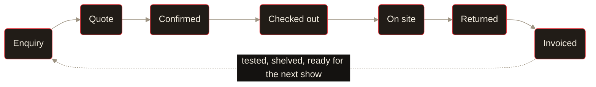

<!-- Owner: Jayden Nawotka · Last reviewed: 2026-08-01 (review quarterly — POLICY.md R-5.5) -->

 

<picture>
  <source media="(prefers-color-scheme: dark)" srcset="docs/brand/rvlt-flow-wordmark-dark.svg">
  <source media="(prefers-color-scheme: light)" srcset="docs/brand/rvlt-flow-wordmark-light.svg">
  
</picture>

 
 

### Ops software for live event production.

Jobs, crew, warehouse, gear, compliance.\
One system, built from the actual job flow.

 

 

---

## What it is

RVLT Flow tracks what you own, where it is, which job it's on, and when it's back. It quotes
the job, picks it, sends it out, checks it in, tests it, and invoices it — off one gear list,
so the docket and the quote can't disagree.

It's for AV, theatre and live event companies. Small to mid — the ones currently doing it on
software written for warehouses full of identical boxes, or on a spreadsheet only one person
understands.

 

## The job

Every job runs the same track. Availability is checked against it before you commit, so a
double-booking turns up at the quote instead of on the loading dock.

The quote, packing list, delivery docket, return sheet and invoice all come off that same list.
Nothing gets retyped. Overbook it anyway if the job needs it — you just have to say so on the
way past.

 

## What's in it

|  |  |
|---|---|
| **Inventory** | Serialised and bulk stock, auto asset tags, QR codes, kits that check out on one scan, photos and manuals on any item |
| **Jobs** | Line items priced per day, week, flat or hour. Groups, discounts, sub-hire, templates for the shows you do every year |
| **Warehouse** | Scan-based check-out and check-in on any phone with a camera. Pull sheets, condition on return, conflict blocking. No app store |
| **Crew** | Staff, freelancers and contractors. Skills, certs, offers, timesheets, a 14-day planner, call sheets, personal iCal feeds |
| **Scheduling** | Bump in and out, deliveries, pickups, labour calls. Each with its own times, location, status and crew |
| **Documents** | Quotes, invoices, packing lists, return sheets, delivery dockets. Rendered once and stored — the copy you sent the client is the copy you keep |
| **Test & tag** | AS/NZS 3760:2022 register, electrical test records, due schedules, 10 report types, compliance certificates |
| **Maintenance** | Repairs, preventative work, firmware, inspections. Overdue items surface themselves |
| **Money** | Costs, charges and margin on every line, visible to the people whose role says they can see it |
| **Teams** | Multi-tenant. Five roles, granular permissions, 2FA, passkeys, and an audit trail on every write |
| **Agents** | REST, MCP and OAuth 2.1, plus Mira in-app. An agent gets exactly the access the person asking already had |

 

## Under the hood

|  |  |
|---|---|
| **Next.js 16** · React 19 · TypeScript strict | App Router, Turbopack |
| **Convex** | Sole copy of domain data. Reactive — the warehouse screen updates when the office edits the job |
| **PostgreSQL + Prisma v7** | Auth and audit log only |
| **Better Auth** | Organizations, 2FA, passkeys |
| **Tailwind v4** + shadcn/ui | Dark espresso, one red accent, hard offset shadows |
| **pdfme** · **Resend** · **Google Maps** · **PostHog** | Documents, email, addresses, observability |

Governed by [`POLICY.md`](./POLICY.md) — numbered RFC-2119 rules. Coverage, bundle size, query
latency and crash-free sessions are CI-enforced budgets that can only ratchet down.

 

---

**[See it running →](https://flow.rvlt.app)**

 

*Building on it?* [Architecture](./ARCHITECTURE.md) · [Contributing](./CONTRIBUTING.md) · [Design system](./DESIGN.md) · [Feature docs](./FEATUREDOCS/) · [Budgets](./docs/budgets.md)

 

Source-available under the [Business Source License 1.1](./LICENSE). Use it, change it,
self-host it, run your rental company on it. Don't resell it as a hosted service.\
Each version goes Apache 2.0 four years after release.

