# Rentman — competitive/product research

**Status:** Research notes (not a spec). **Date:** 2026-07-26
(updated same day with deep dives on Warehouse prep/scan §7, Maintenance §8,
and Statistics §9).
**Method:** Hands-on walkthrough of a full Rentman demo instance
(`ttptest.rentmanapp.com`, account "Two Toned Production", region `us-west-2`,
API endpoint version `4.896`, frontend `5.1320`) with pre-loaded demo data,
plus inspection of the app's network traffic to infer the data model and API
shape. Screenshots referenced below live in
[`assets/rentman/`](./assets/rentman/).

Rentman is a cloud rental-management platform for the AV / event-production
industry (equipment rental, dry-hire, staging, lighting, sound). It is the most
direct incumbent to compare GearFlow against. This doc captures **what it does,
how the workflows hang together, and how it is modelled** — the parts most
relevant to GearFlow's domain.

---

## 1. Shape of the product

Single-page app (Vue) behind a hash router (`#/projects/128/materials`,
`#/equipment/603`, `#/configpanel/roles`, …). Left sidebar is the module list;
opened projects/equipment become **tabs across the top** (a project stays
"open" and pinned until you explicitly Close it — navigation is tab-oriented,
not page-oriented).

Top-level modules (sidebar):

| Module | Purpose |
|---|---|
| Dashboard | Customisable widget boards (revenue, open invoices, quotations) |
| My schedule / Job board | Personal agenda + crew self-service job board |
| **Warehouse** | Prep/scan lifecycle, Combinations (kit content status), Cross-docking, Warehouse tracking log |
| **Projects** | The core: quotes → jobs → dockets → invoices. Plus Rental requests |
| **Crew planner** | Gantt board for scheduling crew + transport across all projects |
| **Shortages** | Rental shortages, Sales shortages, **Subrentals** |
| **Financial** | Invoices, To be invoiced, Purchase orders |
| **Equipment** | Catalog, Serial numbers, Stock locations, Archives |
| Contacts / Crew members / Vehicles | Master data (CRM, staff, fleet) |
| Tasks | Assignable to-dos with deadlines, attachable to any entity |
| Time registration | Hours, planned activities, leave requests |
| Maintenance | Repairs, Inspections, Equipment to inspect, Lost equipment, Inventory counts |
| Statistics | Reporting |
| Communication | Communication log, Emails sent, Notes received |
| Configuration | The whole customization/admin surface (see §7) |

Everything is scoped by a **stock location / warehouse** selector (Eastern /
Western / Venue warehouses in the demo) and a **date-period** selector that
drives availability and planning views.

---

## 2. Projects — the core workflow

A **project** is the central object. It carries a status that drives a state
machine: `Draft → Inquiry → Quotation/Pending → Confirmed → (Cancelled)`.
Projects have a display **Number** (separate from the internal DB id — e.g.
display "126" is internal id `128`), a colour, an account manager, a client
(contact) + separate on-site location contact, a project type (Production,
Dryhire, Transferproject, …), and a timezone.

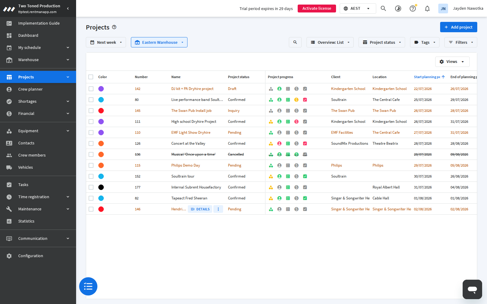

Two time concepts, tracked separately per project and per line:
- **Usage period** — when the customer has the gear.
- **Planning period** — the wider warehouse window (prep + travel + return).
- A **calculated planning period** rolls these up.

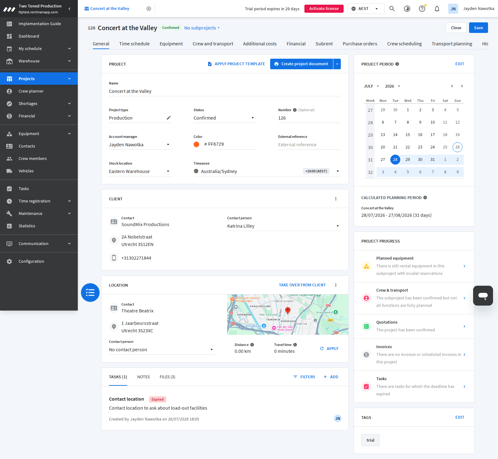

A project supports **subprojects** (variants / phases under one job). The
"Project progress" widget nudges the user through the lifecycle: planned
equipment (invalid reservations?), crew & transport fully planned?, quotations
sent, invoices, tasks overdue.

### Project tabs (per (sub)project)

`General · Time schedule · Equipment · Crew and transport · Additional costs ·
Financial · Subrent · Purchase orders · Crew scheduling · Transport planning ·
History log`

- **Time schedule** — named time bands (Usage period, Planning period, custom)
  each linked to equipment/function groups, with a Gantt timeline.
  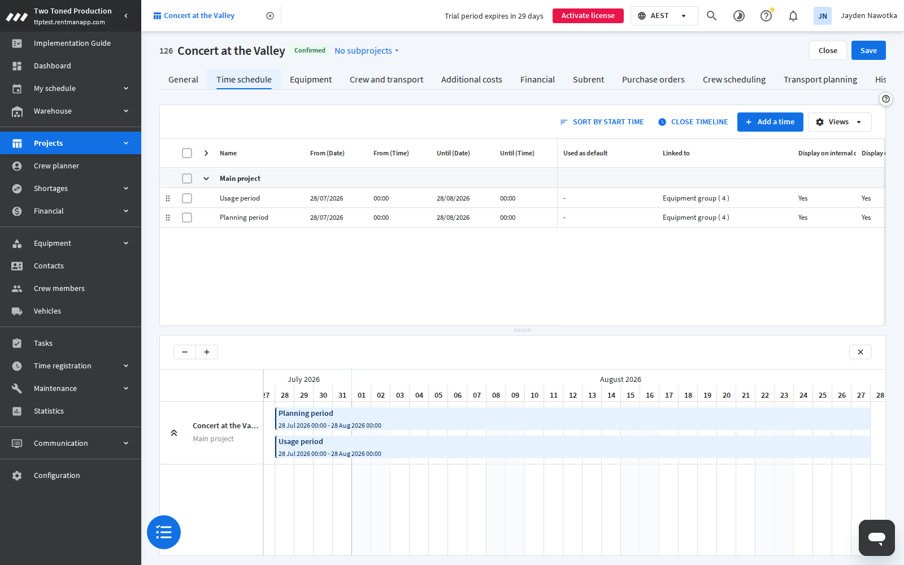

- **Equipment** — the booking grid. A left catalog pane (folder tree +
  search + "smart suggestions") feeds a right pane of booked lines, grouped
  into **equipment groups** (e.g. "Wireless", "PA"). Lines carry Quantity,
  Type, Code, Discount, Total price. Types seen: *Physical item – Bulk*,
  *Virtual combination – Rental*. A bottom Gantt shows per-line availability
  (red = shortage). Kits/combinations expand to their children.
  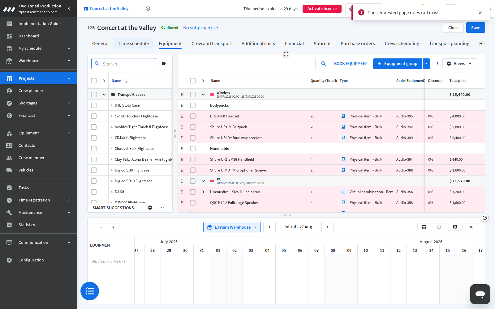

  Each booked line is editable: **Quantity, In-option (yes/no), Factor,
  Discount %, Unit price, GST class, Ledger – credit, Ledger – debit**, plus
  rich-text external remark. (Pricing = factor × unit price, adjusted by
  discount; see §5.)
  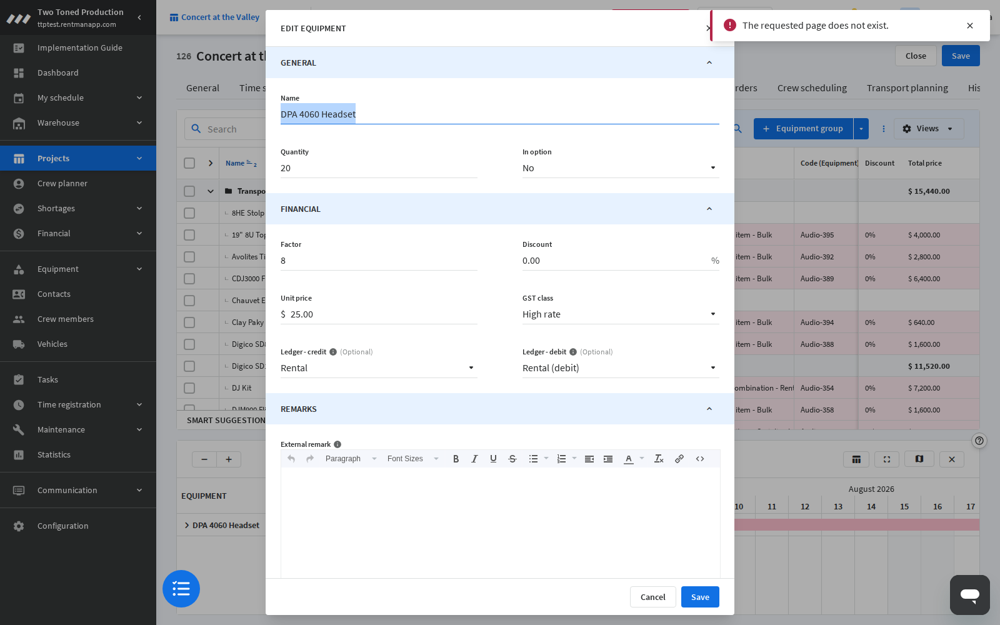

- **Crew and transport** — a parallel grid of **functions** (Audio Engineer,
  Light Operator, Transport up to 6 m³, …) grouped into **function groups**,
  often per show-day (Rehearsal Day 1/2/3, Show 1…). Each function row has a
  quantity, usage period, cost and price. "Ungrouped functions" (Setup,
  Dismantling) sit above the day groups.
  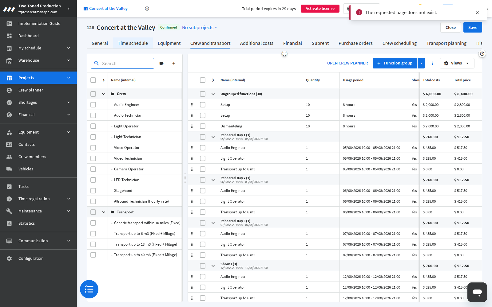

- **Additional costs** — free-form cost lines (Parking, Hotel, Meal). Gated
  behind higher plan tiers ("Crew scheduling: Pro / Equipment scheduling: Pro").

- **Financial** — the money view (see §5). Quotations, contracts, invoices,
  a per-category financial overview, terms & conditions, invoice moment.
  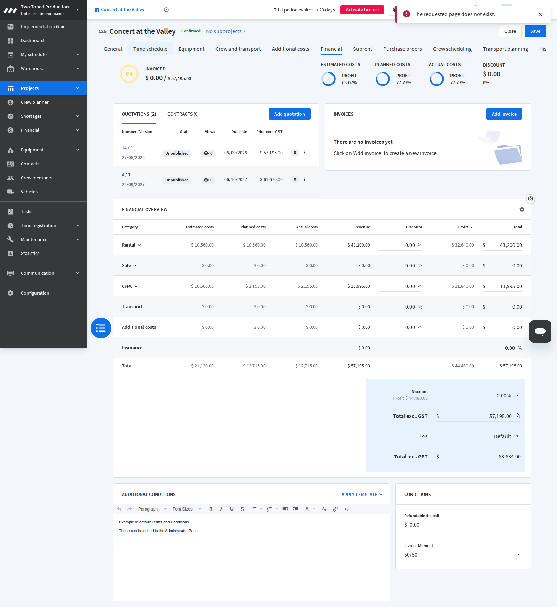

- **Subrent** — equipment on this project sourced via subrental (populated
  when you solve shortages by subrenting).

- **Crew scheduling** — assign named crew to the functions, with per-person
  expense columns (catering, travel, accommodation, other). Shows "Functions
  not scheduled" warnings.
  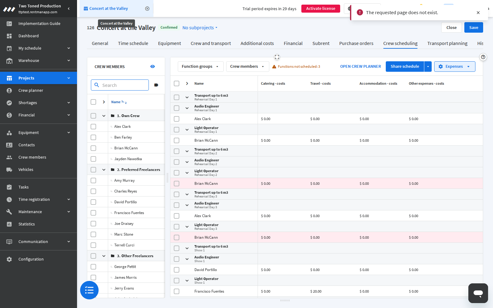

- **Transport planning** — assign vehicles to transport functions; tracks
  "fully planned" state and travel time.
  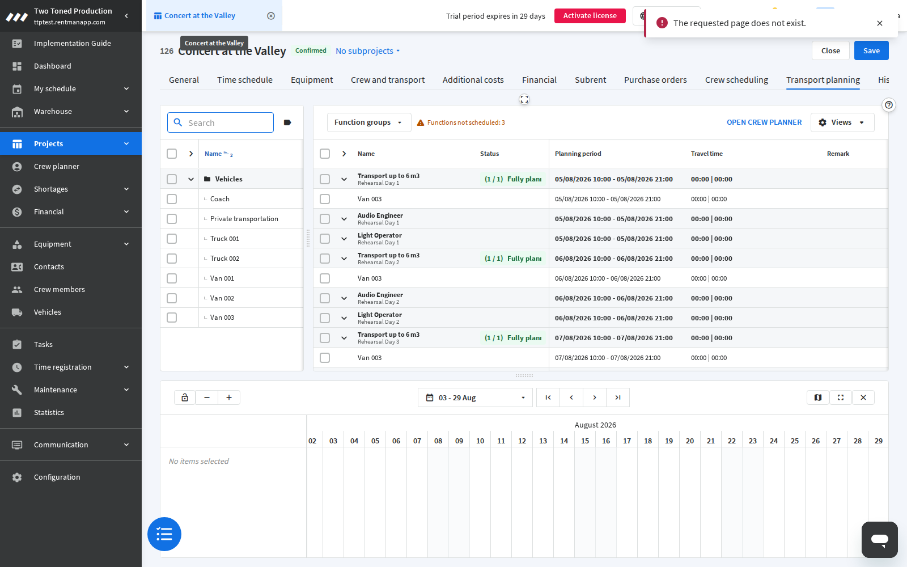

- **History log** — point-in-time "saves" with a diff viewer (a paid
  History Logs add-on).

### Documents

"Create project document" opens a generator: pick a **template** (Carnet,
quote, contract, packing list, …) + **letterhead** + timezone + which
subprojects, with an editable rich-text body supporting **merge variables**
("Add variable") and reusable snippets ("Apply template"). This is the
quote/contract/docket PDF engine.

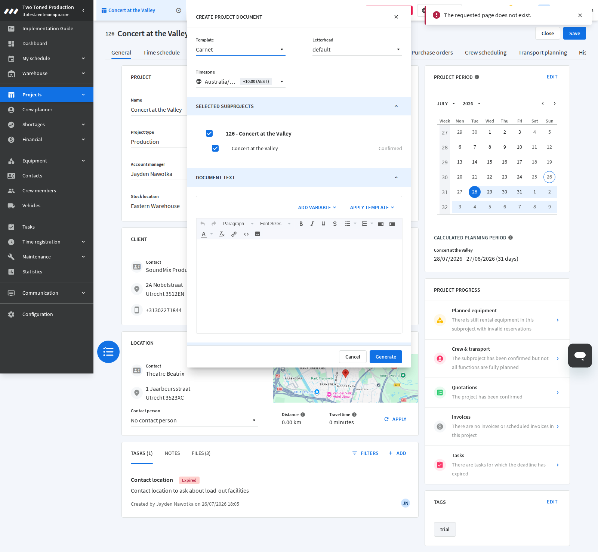

---

## 3. Equipment — catalog & inventory

The equipment catalog lists items with Code, Name, **Current quantity excl.
reserved**, Rental/Sales price, Subrent/purchase cost, and Type of equipment.
Items live in a **folder tree** and are scoped to a warehouse.

### Equipment master record

Item detail has its own tab set:
`Data · Serial numbers · Insights · Default content · Stock · Accessories ·
Alternatives · Suppliers · Periodic inspections · Webshop · Repairs ·
Inventory counts`.

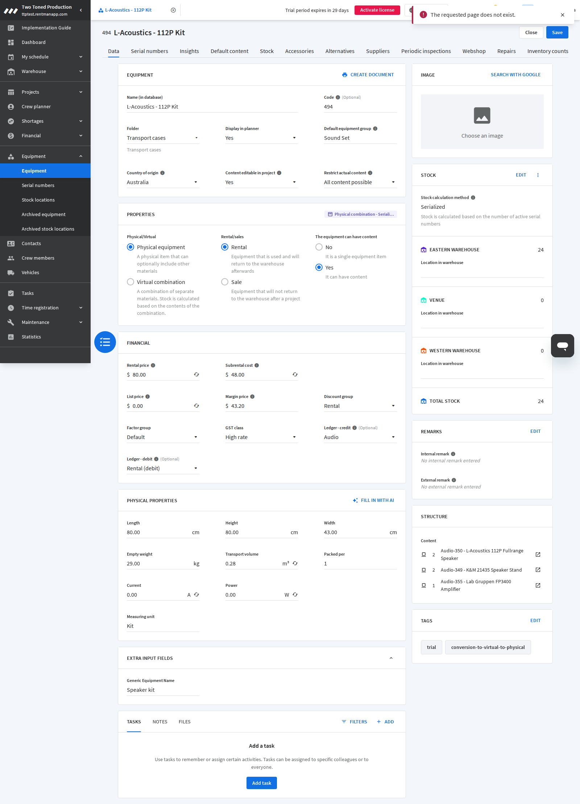

Key modelling on the **Data** tab:

- **Physical/Virtual** — *Physical equipment* (a real item that may contain
  content) vs *Virtual combination* (a bundle whose stock is derived from its
  contents).
- **Rental vs Sale** — returns to warehouse vs consumed.
- **"Can have content"** — single item vs a container/kit that holds other gear.
- **Stock calculation method** — e.g. **Serialized** (stock = count of active
  serial numbers). Per-warehouse stock is shown (Eastern 24, Venue 0, Western 0,
  Total 24).
- **Financial** — Rental price, Subrental cost, List price, **Margin price**,
  **Discount group**, **Factor group**, **GST class**, **Ledger credit/debit**.
- **Physical properties** — Length/Height/Width, Empty weight, **Transport
  volume (m³)**, Packed per, Current (A), Power (W), Measuring unit. (There's a
  "Fill in with AI" helper that infers these — see §7.)
- **Structure / Content** — for kits, the bill of contents (e.g. the "112P Kit"
  contains 2× 112P speaker, 2× K&M stand, 1× Lab Gruppen amp).
- **Extra input fields** (custom fields), tags, images.

**Combinations vs kits:** a *virtual combination* has no stock of its own; a
*physical combination* is a real container whose contents are tracked. The
Warehouse → Combinations screen tracks each physical combination instance's
**content status** (Complete / Incomplete) per serial.

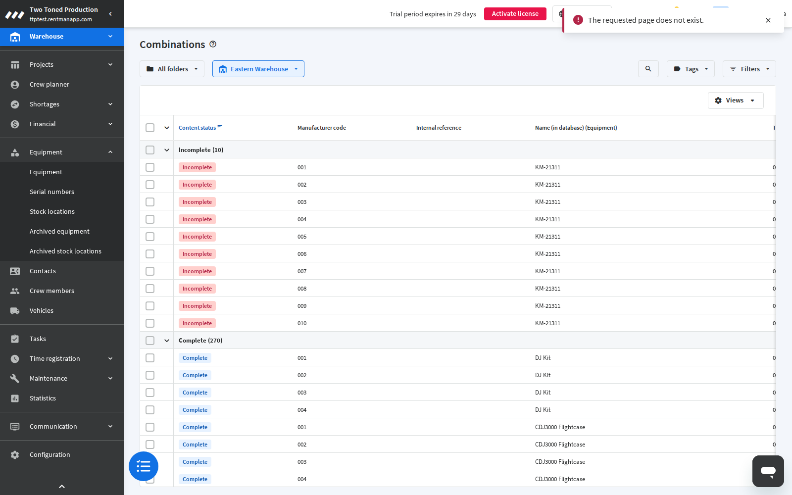

### Serial numbers

Per-item serial register: internal reference, manufacturer code, **content
status** (Complete), stock-location, remark, and inspection dates
(last/next inspection). This is the individually-trackable-asset layer under
the bulk quantity.

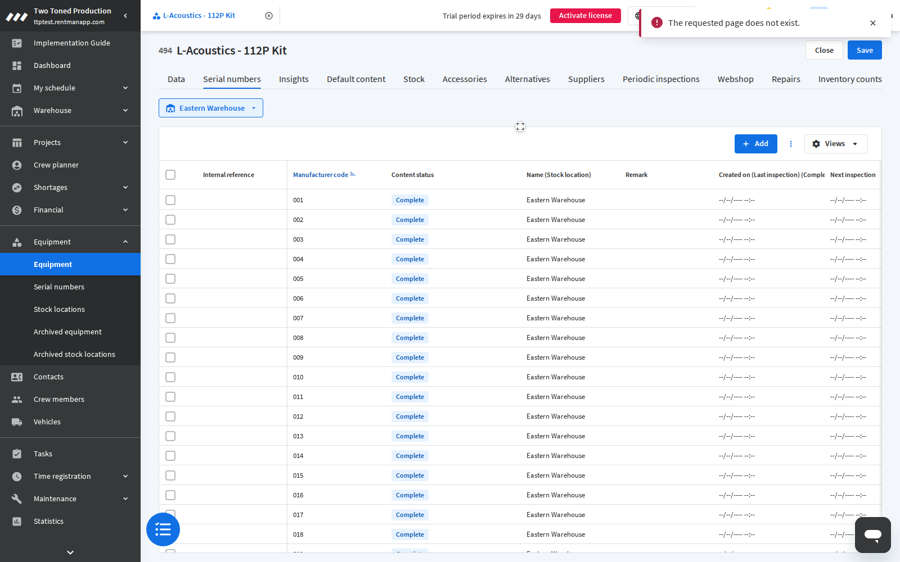

Accessories tab: linked accessories with columns Quantity / Automatic / Skip if
already present / Add as new line / Free — i.e. rules for auto-adding
accessories when the parent is booked.

---

## 4. Availability, shortages & subrentals

Rentman's **availability engine** compares planned demand against stock across
the planning window. The **Rental shortages** screen is its output: per item,
the Shortage quantity, Planned, Quantity from own warehouse, Subrented, a
**Reason** (`Shortage`, `Invalid reservations`, `Shortage solved`, `Shortage of
own stock available`) and the date the shortage starts.

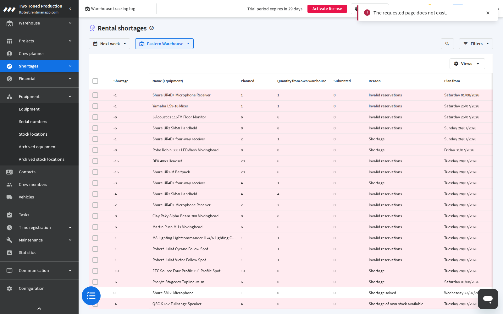

Shortages are resolved by **subrenting**. The Subrentals screen groups subrents
by destination stock location and tracks Supplier, Status
(Pending/Confirmed), linked purchase order, From/To stock location, Total:

- **External subrentals** — hire in from a supplier (e.g. "Highlite").
- **Internal subrentals / transfers** — move stock between own warehouses
  (Western → Eastern), surfaced as a "Transferproject".

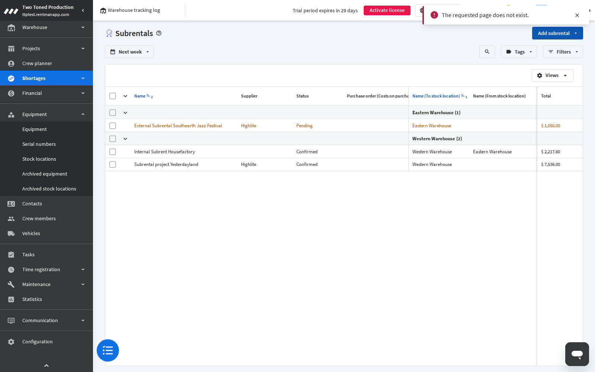

There's a separate **Sales shortages** track for consumable/sale items.

---

## 5. Financial model

The project **Financial** tab is the commercial hub:

- **Quotations** (with version numbers, view-tracking, due date, price
  excl. GST, publish/unpublished state) and **Contracts**, side by side.
- **Invoices** created from the project; supports partial invoicing via an
  **Invoice moment** (e.g. `50/50`) and a **refundable deposit**.
- **Financial overview** broken down by category — **Rental, Sale, Crew,
  Transport, Additional costs, Insurance** — each with **Estimated / Planned /
  Actual costs, Revenue, Discount, Profit, Total**. Header KPIs show profit %
  at estimated/planned/actual and invoiced %.
- **GST/tax** handled via per-line **GST class** and a project-level GST
  setting; totals shown excl. and incl. GST.
- **Terms & conditions** rich-text with templates.


Pricing mechanics observed:
- Line price = **unit price × factor**, then **discount %**. The *factor*
  captures multi-day / tiered rental multipliers via **factor groups**
  (`Staffelgroep` in the schema — "staffel" = tiered/graduated pricing).
- **Discount groups** (`Kortingsgroep`) and **ledgers** (`Grootboek`,
  credit + debit) attach to each item and flow to accounting.
- Cost vs price is tracked separately (subrental/purchase **cost** vs rental
  **price**), which is what drives the profit columns.

Standalone Financial module: **Invoices** (number, account manager, client,
payment/due dates, project, price excl. GST), **To be invoiced** (projects
ready to bill, grouped by project type — Dryhire, Transferproject…), and
**Purchase orders**.

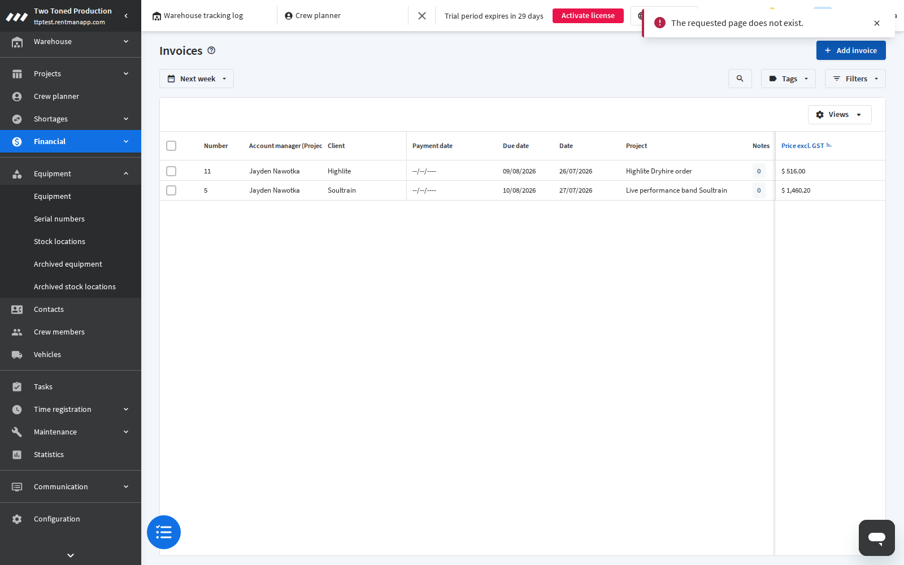

---

## 6. Warehouse, crew & transport operations

**Warehouse prep lifecycle** is driven by **warehouse statuses**:
`Confirmed → On location → Prepped → Returned` (Confirmed/On location/Returned
are locked system statuses; Prepped is a custom, reorderable one). Scanning gear
in/out transitions these states.

The **Warehouse tracking log** is the audit trail of every scan/transition:
timestamp, equipment, crew member, action (`Booked to "On location"`,
`Repair created`, …) and project.

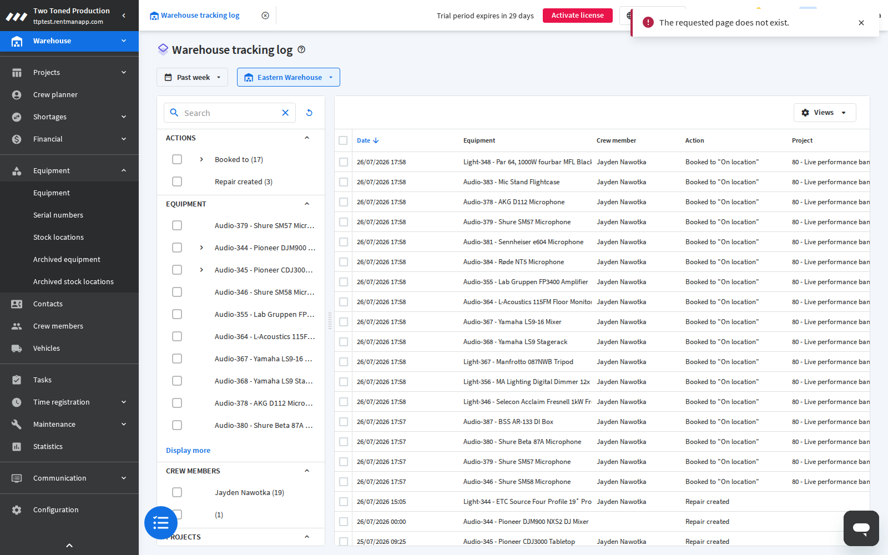

**Crew planner** is a cross-project Gantt: rows = projects/functions, columns =
days; cells show planned crew (`1/1` filled) and vehicles (Van 002/003). A
bottom pane does **availability matching** — for a selected function it shows
crew who are *Planned in project / Available / Matching* (by skill + free time).
Crew are grouped Own Crew / Preferred Freelancers / Other Freelancers.

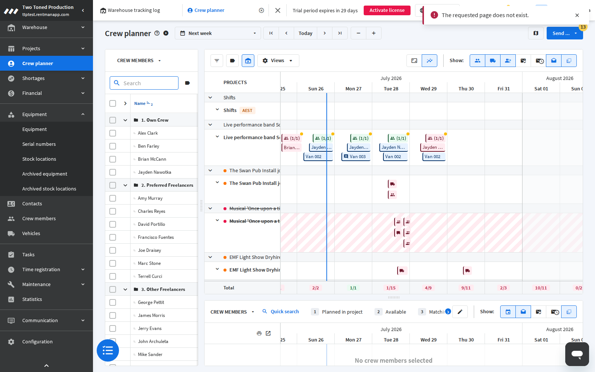

Master data: **Crew members** carry a folder group and a **User role**
(Poweruser / Office / Freelancer); **Vehicles** carry inspection date +
registration; **Contacts** are the CRM (companies + contact persons, with
invoice moment, payment condition, tax schema per contact).

---

## 7. Warehouse prep & scanning (deep dive)

The **Warehouse** module's landing page is the operations command centre for a
given day + warehouse. Layout:

- Top: a **Transports** timeline (vehicles vs time, with the project/function
  they're assigned to) and a **Scheduled crew** timeline (crew vs time) for the
  selected day.
- Bottom: a **Kanban board of projects by warehouse status** —
  `Confirmed → Prepped → On location → Expected back → Delayed`. Each project
  card carries its number, warehouse, client, start-of-planning-period, notes,
  a **QR code** (scan to open that project's booking), and per-card **Book** and
  **Change status** actions. Projects flow left→right as gear is prepped and
  shipped.
- A **Scan return** button (top-right) opens the check-in flow.

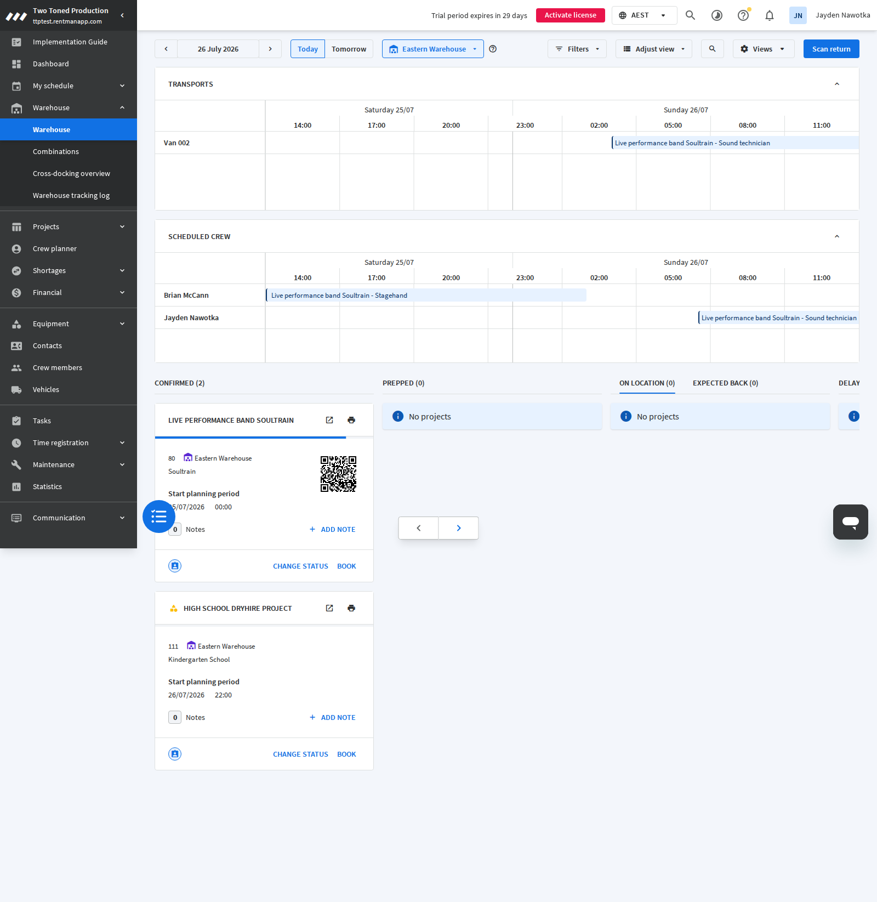

**Booking / picking / scanning** (`/warehouse/booking/<project>`) is where gear
is actually pulled and checked out:

- Two status columns side by side (**Confirmed → Prepped**), each scoped to a
  warehouse.
- A **Scan code** field (barcode/QR entry, with an audio-feedback toggle so a
  handheld scanner "beeps" on each hit) — scan an item's barcode to advance it.
- Equipment is grouped (e.g. "Sound"); each line shows **quantity progress**
  (`1/1`), code, name, and a per-line action to **assign specific serial
  numbers** to the booking.
- For kits/combinations, an *"Equipment not yet assigned to combination …"* row
  lets you bind specific serials/exemplars to the kit instance being packed.
- **Book everything** bulk-advances a whole group/status.

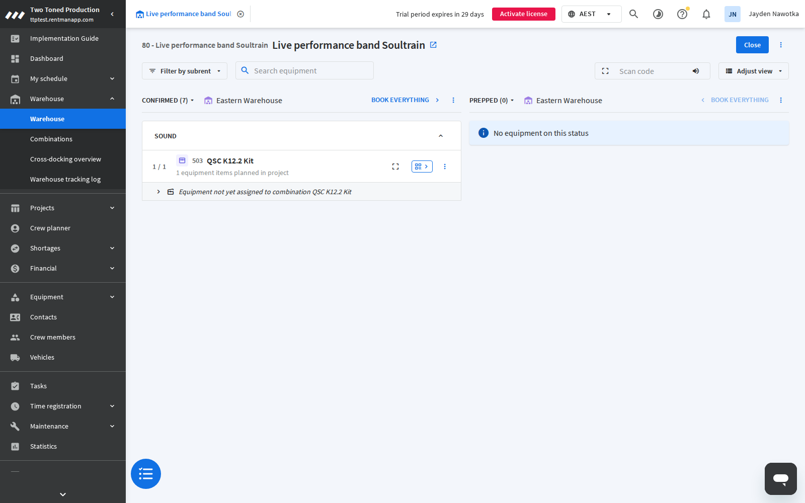

**Scan return** (`/warehouse/scanretour/…`) is the check-in counterpart: a
warehouse-scoped screen with a single **Scan code** field ("scan equipment items
to book them back"), scan preferences, and audio feedback — no project needed,
just scan whatever is coming back. Each scan writes a row to the Warehouse
tracking log (§6) and transitions the item's warehouse status. This desktop flow
mirrors Rentman's native warehouse/crew mobile apps.

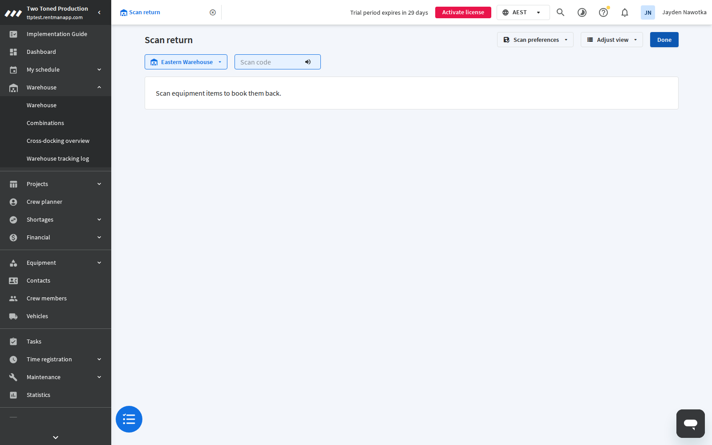

---

## 8. Maintenance

A dedicated module for the service lifecycle of individual assets (serials):

- **Repairs** — repair records per serial: Number, Equipment, Serial number,
  Stock location, and a free-text remark (e.g. "Broken Fader", "Bulb Blew Up",
  "Defective RJ45 port"), grouped by warehouse with a **Repair status** filter
  and **Add repair**. Repairs can be raised manually or generated from the
  warehouse scan flow (the tracking log shows `Repair created` actions), which
  pulls the item out of available stock.
  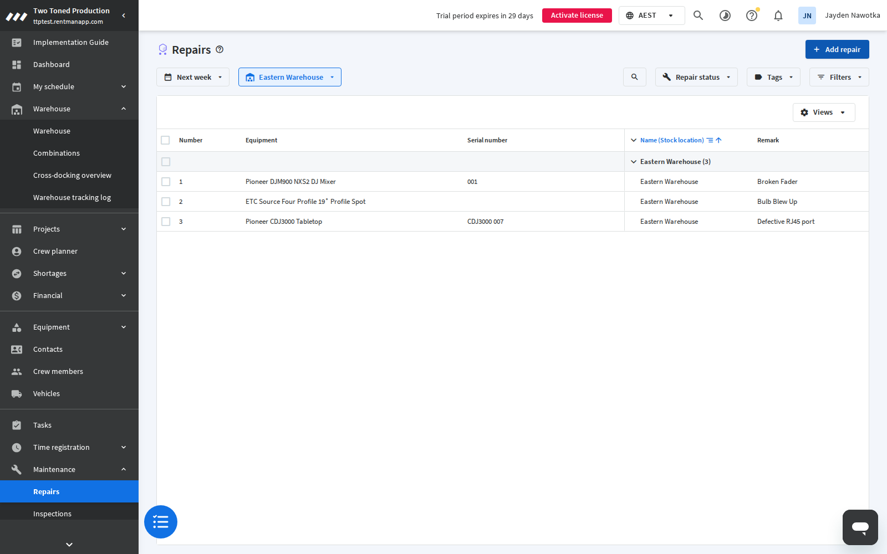

- **Inspections** — completed/scheduled inspection records (Inspection date,
  Name e.g. "Yearly cleaning", Description, Status e.g. *Approved*, Notes), with
  Import + **Add inspection**.
  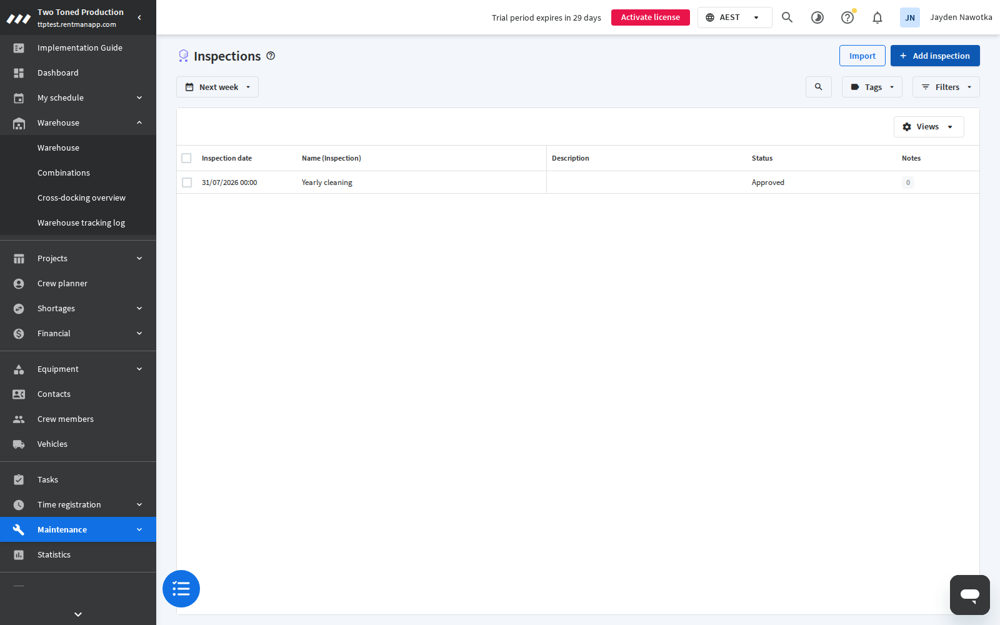

- **Equipment to inspect** — the worklist of serials **due** for a scheduled
  inspection: Equipment, Manufacturer code, inspection Name (e.g. "Yearly
  cleaning"), Internal reference. Driven by the **periodic inspection** schedules
  configured on the equipment record and in Configuration.
  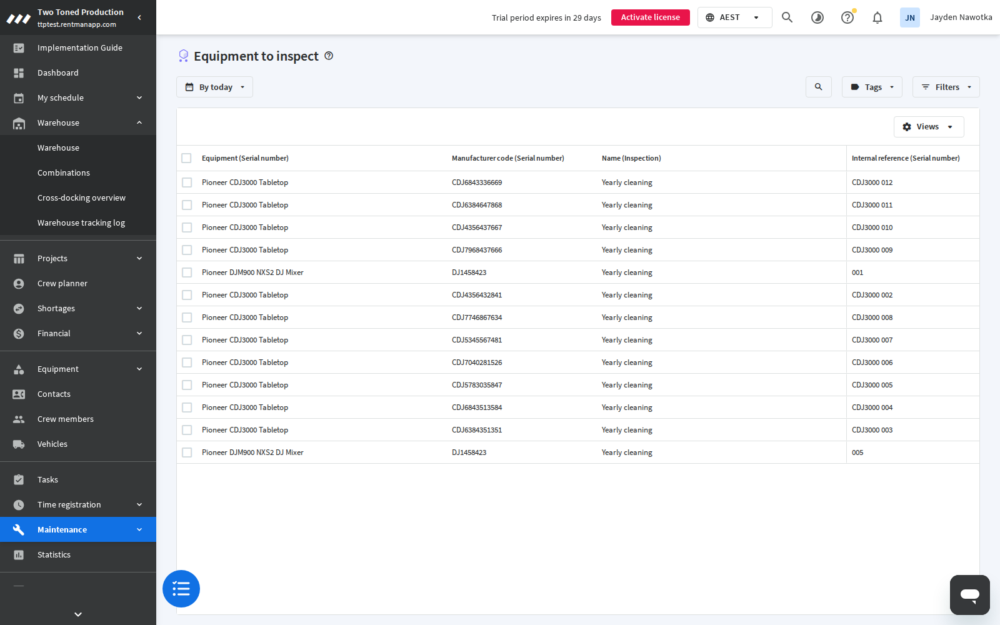

- **Lost equipment** — a register of lost items (**Add lost equipment**), which
  removes them from available stock (empty in the demo).
- **Inventory counts** — stock-count/stocktake sessions (**New inventory
  count**) to reconcile physical vs system stock per warehouse (empty in the
  demo).

Together these are the "why isn't this item available" side of the availability
engine: an item in repair, lost, or failing inspection is subtracted from
bookable stock, and the Statistics module reports **repair history** and
**percentage unusable** per item (§9).

---

## 9. Statistics & reporting

A reporting workspace built on saved **statistic** definitions. The landing page
is a library of reports grouped by **report type**:

- **Crew** (e.g. "Frequently planned freelancers")
- **Projects per account manager** (generated revenue; planning-vs-actual diff)
- **Projects per project type** (generated revenue; to-be-expected revenue)
- **Rental equipment** (repair history; revenue; planned rental equipment)
- **Sales equipment** (revenue of sale items)
- **Subrental per supplier** (subhire spend per supplier)

**Add statistic** creates a new named report of one of these types.

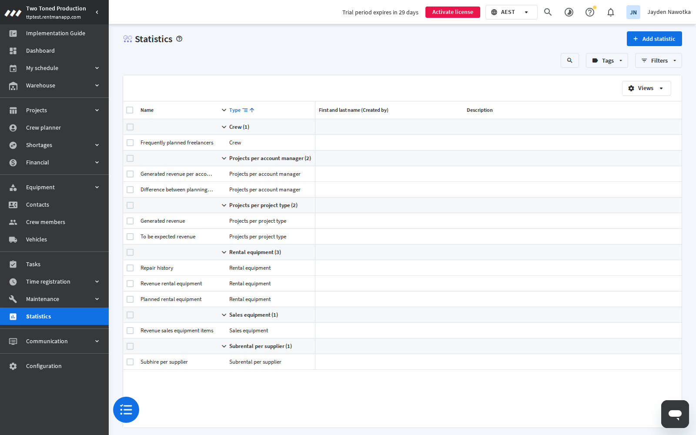

Each statistic has three tabs:

- **Data** — name, type, description (metadata).
- **List** — the report table: rows grouped (e.g. by default equipment group:
  Active Speakers, Amplifiers, Controllers, Conventional…), with a **date-range
  selector**, configurable **column sets**, filters, and a totals row. For
  rental equipment the columns are effectively an **asset-ROI/utilization**
  view: Revenue, Costs of repair, Subrental costs, **Average daily rental**,
  Average discount, **Usage percentage**, **Percentage unusable**.
  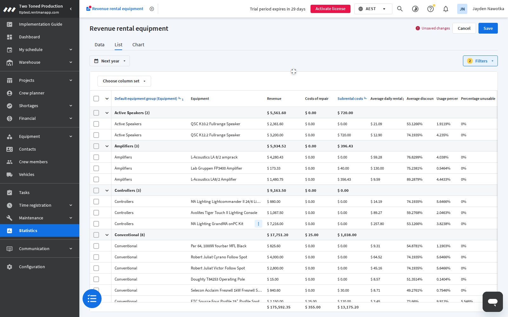
- **Chart** — pick a chart type (bar, …) and one or two columns to plot
  (e.g. Revenue vs Subrental costs) as a dual-axis chart per item, with
  **Download**.
  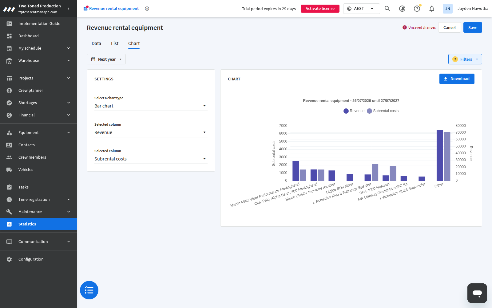

This is the layer that answers "which gear earns its keep" — combining revenue,
repair cost, subrental cost and utilisation per item — plus revenue reporting by
account manager / project type / supplier. (Dashboards in §1 are the at-a-glance
widget version; Statistics is the drill-down/export version.)

---

## 10. Configuration & extensibility

The Configuration panel is the admin surface:

- **Account:** Company details, License, Invoice history, **User roles**,
  **Integrations**, Backups.
- **Settings:** Time and location, Important days, **Number series**, **Project
  types**, **Project templates**, Periodic inspections, Time registration &
  leave, **Warehouse statuses**, **Extra input fields** (custom fields), Empty
  database.
- **Communication:** Email, Digital signing, (quotation settings), **Document
  templates**.

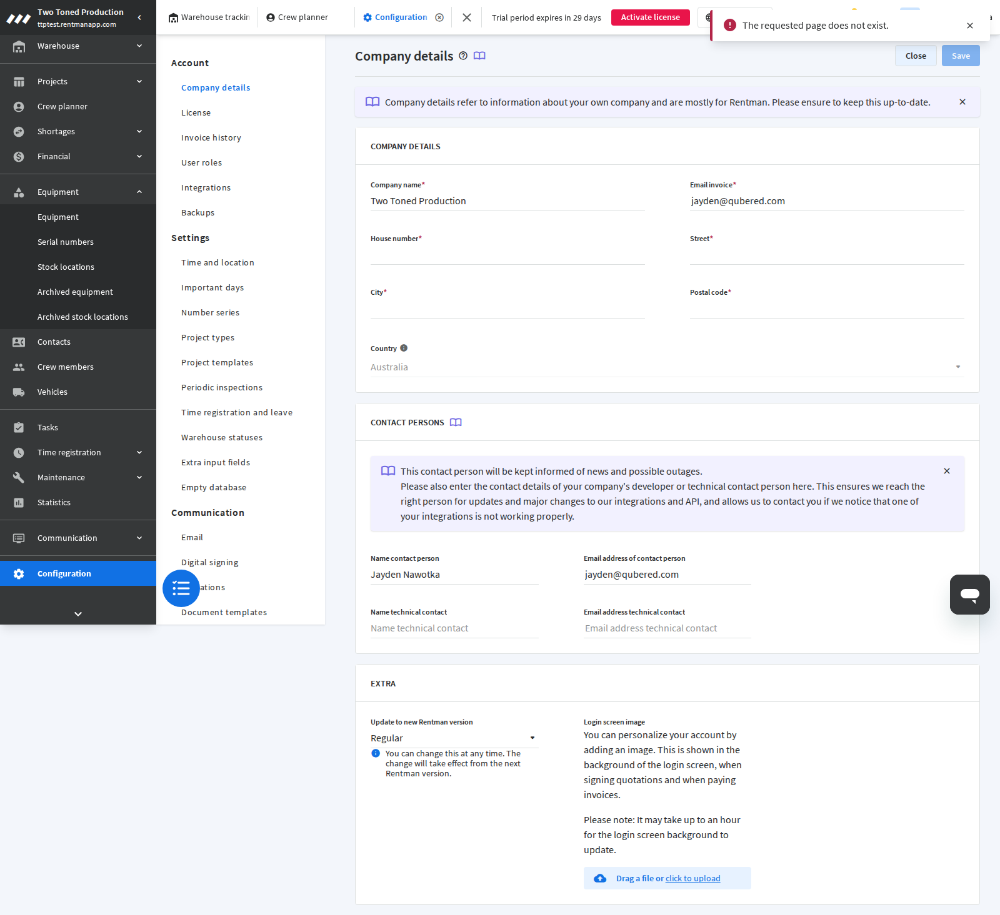

**User roles / licensing:** roles are fully custom permission sets. Only
"power user" roles (starred) are **paid seats**; Office/Freelancer roles are
free. Poweruser rights seen: writing rights for invoices, writing rights for
projects, can plan crew, access to configuration, can approve purchase orders,
can review leave requests. This is the seat-based commercial model.

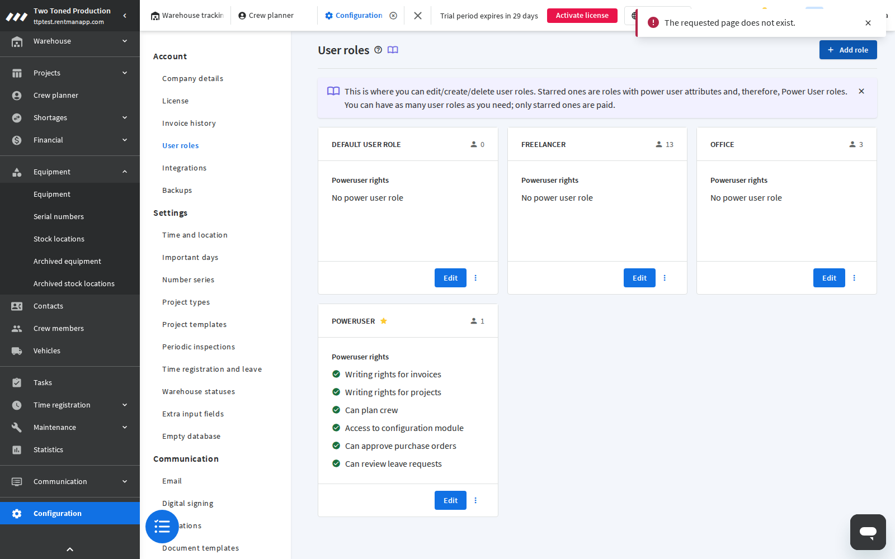

**Custom fields ("Extra input fields"):** user-defined fields attachable per
entity (Equipment, …) with a field type (Text, …), Hidden and Confidential
flags, and usable as **document merge variables**.

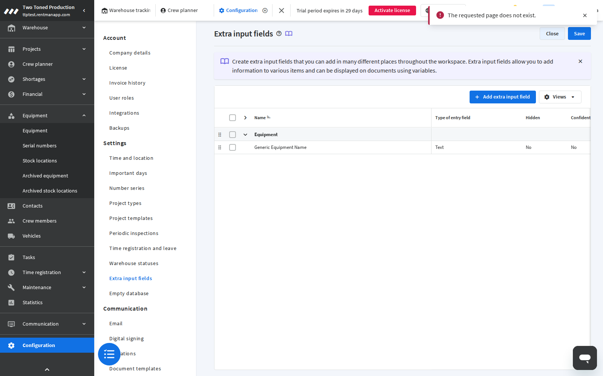

**Integrations** (external surface):

- **REST API** — token-based; "enable the API to grant external applications
  access… external applications use this token" (rotating a token invalidates
  the old one). Account flag `OPENAPI` present.
- **Webhooks** — push add/update/remove events to an external app.
- **Webshop plugin** — public rental webshop.
- **Rental requests** (receive requests from other Rentman users) and **Email
  notes** (auto-link inbound email to a project by `#number` in the subject).
- **External connectors:** QuickBooks, Xero (invoice/contact export), Zapier.
- **AI functionalities** — a "Fill in with AI" feature that sends data to
  ChatGPT to (a) generate quote text (project name, equipment groups, names &
  prices, account language), (b) infer equipment physical properties, and
  (c) generate document-template HTML/CSS.

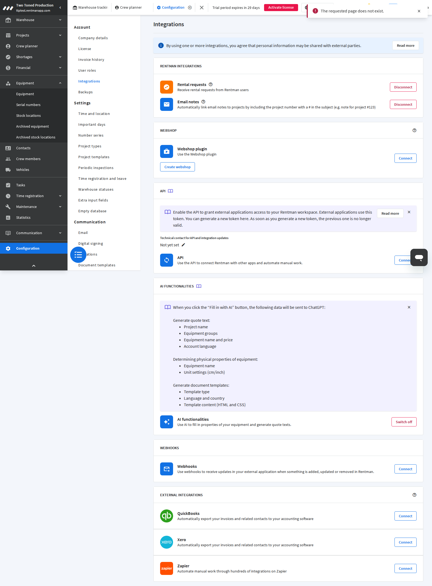

---

## 11. Technical architecture (inferred from traffic)

The frontend talks to a **single RPC gateway**, not a REST resource tree:

```
POST https://api.us-west-2.rentmanapp.com/4.896/api.php
{
  "client":   { "language":20, "session":"…", "version":"5.1320.0.1", "name":"frontend" },
  "account":  "ttptest",
  "requestType": "query" | "modulefunction" | "fields" | "mergeditemmethod",
  "itemType": "Project",              // for query/fields
  "columns":  { "Project": ["displayname","nummer","id", …] },
  "query":    { "key":"id", "comparator":"IN", "value":[128] },
  "module":   "equipment", "method":"getStockQuantities"   // for modulefunction
}
→ { "response": { "value": …, "type":"json", "nonexistentitems":[], "feedback":[] },
    "socketmessages":[…], "errorCode":0,
    "version":{ "endpoint":"4.896","valid":true } }
```

- **`query`** is the workhorse (most calls): fetch an `itemType` with an
  explicit column list and a predicate (`key`/`comparator`/`value`, comparators
  like `IN`). Effectively a typed query DSL over the data model.
- **`fields`** returns column/field metadata for a type (drives the
  configurable grids).
- **`modulefunction`** is RPC (`module.method`) for behaviour that isn't plain
  CRUD, e.g. `equipment.getStockQuantities`,
  `equipment.getSerialStockAlignment`, `planboard.getOverlapping`,
  `trackinglog.getTrackingLogs`, `inhuur.getConnectedSubrentDetails`,
  `permissions.getPermissions`, `settings.getAccountSettings`.
- **Realtime:** a socket.io channel (`websockets.us-west-2.rentman.net`) pushes
  live changes; responses also carry `socketmessages`.
- **Auth:** login issues a JWT (`RMAuthService`), and API calls carry a numeric
  `session`. Permissions come back as a module → permission map.
- Multi-region (`us-west-2`; EU region also referenced). LogRocket + Segment +
  Zendesk are wired into the frontend.

### Data model (canonical entity names)

The schema uses **Dutch** field/table names (visible in `query` `itemType`s and
grid column keys — e.g. `naam`, `leverancier`, `gebruikvan`/`gebruiktot`).
Entities observed in traffic:

| Rentman entity | Meaning |
|---|---|
| `Project` / `Subproject` | Project / subproject |
| `Materiaal` / `MateriaalCat` | Equipment / equipment category |
| `Exemplaar` | Serial number / physical instance |
| `Setinhoud` | Kit/set contents |
| `Accessoire` | Accessory |
| `Combination` | Combination (kit) |
| `Barcode` | Barcode |
| `Voorraadmutatie` | Stock mutation |
| `Projectshortage` / `Missing` | Shortage |
| `Inhuur` | Subrental |
| `Planningmateriaal` / `Planningpersoneel` / `Planningtransport` | Equipment / crew / transport planning rows |
| `Functie` / `Functiegroep` | Function / function group (crew & transport) |
| `Medewerker` / `Person` | Crew member / person |
| `Contact` / `Leverancier` | Contact (CRM) / supplier |
| `Voertuig` | Vehicle |
| `Factuur` / `Factuurdatum` | Invoice / invoice moment |
| `Staffelgroep` | Tiered-pricing (factor) group |
| `Kortingsgroep` | Discount group |
| `Grootboek` | Ledger (general ledger account) |
| `TaxClass` | Tax / GST class |
| `Taak` / `Taaktoewijzing` | Task / task assignment |
| `Uren` / `Tijd` | Hours / time |
| `Afspraak` | Appointment |
| `Notitie` / `Projectnotitie` | Note / project note |
| `AssetLocation` / `WarehouseShelf` / `Folder` | Warehouse / shelf / folder |
| `Status` | Warehouse status |
| `Customfield` | Custom field |
| `Rol` | User role |
| `NumberSeries` | Number series |
| `Tag` / `Taglink` | Tag / tag link |
| `Optie` | In-option item |
| `GridView` | Saved grid/column view |

---

## 12. Takeaways for GearFlow

Things Rentman does that map directly onto (or challenge) GearFlow's domain:

1. **Two-clock scheduling** (usage period vs planning/warehouse period, per
   line) is fundamental to availability. Worth confirming GearFlow models both.
2. **Serialized vs bulk vs virtual/physical-combination** is the core inventory
   taxonomy, and stock is *derived* differently per type (serial count vs
   contents). This mirrors GearFlow's kit/child/accessory footguns
   (see `CLAUDE.md` PDF-consumer + `isKitChild` notes) — Rentman treats a kit's
   content-status as first-class (Complete/Incomplete per instance).
3. **Availability engine → shortages → subrent/transfer** is one continuous
   flow, with typed shortage reasons and internal transfers modelled as
   projects. A strong pattern to match.
4. **Financial overview by category with estimated/planned/actual + profit** is
   richer than a flat quote total; factor groups (tiered/multi-day pricing),
   discount groups, and dual credit/debit ledgers per item are the pricing
   primitives. (Aligns with GearFlow's "server is the authority on price"
   rule.)
5. **Crew & transport as first-class "functions"** grouped per show-day, with a
   cross-project planner that does availability matching by skill + free time.
6. **Seat-based licensing = only power-user roles are paid**; everyone else
   (office/freelancer) is free — a notable commercial model.
7. **Document generator** = template + letterhead + merge variables over
   project data; custom fields are exposed as variables.
8. **Extensibility**: token REST API + webhooks + Zapier/QuickBooks/Xero, plus
   an opt-in ChatGPT "fill in with AI" for equipment specs and quote text.
9. **Architecture note:** Rentman is an RPC/query gateway over a typed data
   model (Dutch schema names), with socket.io realtime — a contrast to
   GearFlow's Convex + Prisma + server-actions stack.
10. **Warehouse ops are a status Kanban + barcode scan loop** (§7): prep board
    (Confirmed→Prepped→On location→Expected back→Delayed), per-project QR,
    booking screen with serial-to-kit assignment, and a project-less "scan
    return" check-in. Every scan writes an audit-log row and moves stock. This
    is the operational spine GearFlow's own prep/docket flow competes with.
11. **Asset lifecycle feeds availability** (§8): repairs, lost items, and due
    inspections each subtract an item from bookable stock; utilisation is then
    reported per item (§9). Availability isn't just "booked vs owned" — it's
    "booked vs owned minus in-repair/lost/failing-inspection".
12. **Reporting = saved report definitions with List + Chart** (§9), and the
    rental-equipment report is an **asset-ROI view** (revenue, repair cost,
    subrental cost, average daily rental, usage %, % unusable). A concrete
    target for GearFlow's own model-ROI/utilisation analytics.

### Gaps / not fully explored

- Mobile apps (Rentman has native crew/warehouse apps) — not in scope for a
  web-demo pass; the desktop booking/scan-return screens (§7) are their
  counterpart.
- Cross-docking overview and Inventory-count *session* UX (both empty in the
  demo — seen as entry points, no live data to walk).
- The **public REST API** (`OPENAPI`) schema — inferred from the internal
  gateway; the documented external API at `api.rentman.net` would be the next
  reference to confirm entity names/fields for any real integration.
